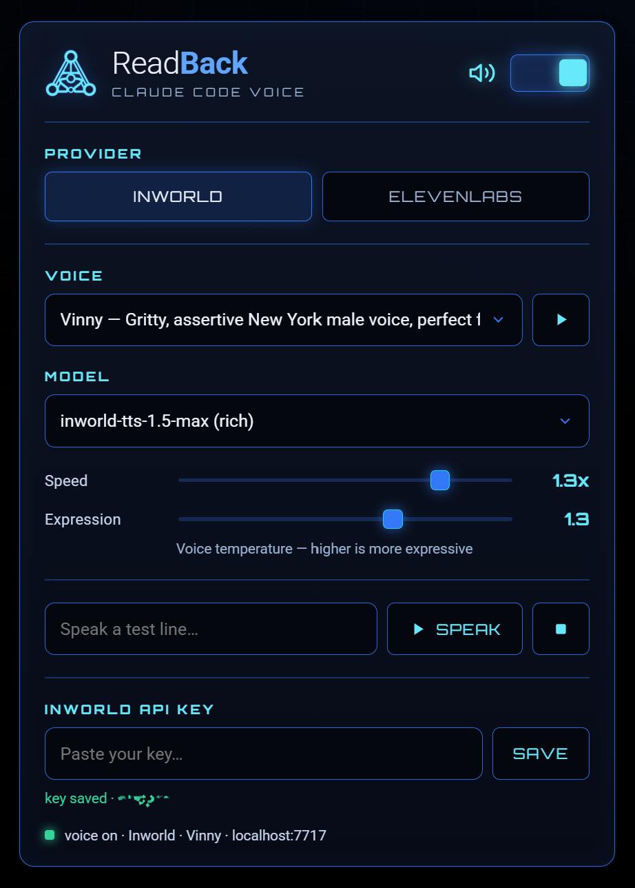

# Readback

**Voice output for Claude Code.** Flip it on and Claude reads its replies aloud —
rest your eyes, or keep half an ear on a long run instead of watching the
terminal scroll. Flip it off and it stops immediately, mid-sentence if the phone
rings.

<p align="center">
  
</p>

- 🪟 **Windows-first** — plays through built-in PowerShell audio, zero external
  dependencies. (Most Claude voice tools are macOS-only.)
- 🎚️ **Two providers** — [Inworld](https://inworld.ai) (hundreds of voices, cheap)
  and [ElevenLabs](https://elevenlabs.io), switchable in a click.
- 🖥️ **GUI-tunable** — a little control panel for voice, model, speed and
  expression, with a live voice picker and in-app key entry. No `.env` fiddling.
- ⚡ **Streaming** — splits replies into sentences and starts talking on the
  first one, so audio kicks in fast even on long messages.

> Unofficial community tool. Not affiliated with, or endorsed by, Anthropic,
> Inworld, or ElevenLabs.

---

## How it works

Three cooperating pieces sharing one state file:

| Piece | Role |
|------|------|
| **MCP server** | in-chat toggle — `voice_on` / `voice_off` / `set_provider` / `set_voice` / `say` / `list_voices` … |
| **Stop hook** | the actual voice — auto-speaks each reply while enabled |
| **Control panel** | `localhost:7717` web cockpit for provider / voice / model / tuning + live preview |

The hook and MCP toggle work whether or not the panel is open.

## Setup (Windows, Node 18+)

```powershell
git clone https://github.com/Deltawerks/readback
cd readback
npm install
npm run panel        # opens the control panel in your browser
```

In the panel: pick a **provider**, paste that provider's **API key**, choose a
**voice**. Then wire it into Claude Code:

```powershell
npm run register     # writes .mcp.json + hooks-snippet.json for this folder
```

- **MCP server:** auto-loads when you work in this folder, or add it globally with
  the `claude mcp add …` line `register` prints.
- **Auto-speak hook:** merge the generated `hooks-snippet.json` into your Claude
  Code `settings.json` (`~/.claude/settings.json` for every project), then restart
  Claude Code.
- **Optional:** `npm run shortcut` drops a "Readback" icon on your Desktop that
  launches the panel with one click.

Quick smoke test without Claude Code:

```powershell
npm run say "readback is online"
npm run voices        # list the active provider's voices
```

## Using it

- In chat: say "voice on" and replies start speaking. "voice off" silences
  instantly — including whatever's playing right then.
- In the panel: switch provider, pick a voice, drag speed / expression, hit ▶ to
  preview. Changes apply to the next spoken reply.

Keys are stored per-user **outside the repo** — `%APPDATA%\Readback\secret.json`
on Windows (`~/.config/readback/` elsewhere), so cloning into a shared or
cloud-synced folder can't sync your key with it. Override the location with
`READBACK_STATE_DIR`. Replies are cleaned before speaking (code blocks dropped,
links flattened, markdown/emoji stripped) and long replies are truncated with a
spoken "…the rest is on screen."

> **Upgrading from an earlier version?** Your key and settings are copied to the
> new location automatically on first run. The originals are left in the repo's
> `.readback/` folder (gitignored) so nothing is lost if you roll back — delete
> that folder once you've confirmed things still work.

## Notes & limits

- Windows only (PowerShell `SoundPlayer` playback). No STT / voice input.
- Speech is provider-agnostic WAV under the hood (Inworld LINEAR16; ElevenLabs
  PCM wrapped in a WAV header), so the streaming player never cares which
  provider you're on.
- The panel is loopback-only (`127.0.0.1`), rejects cross-origin requests, and
  bundles its own logo + fonts, so the page itself loads nothing from the
  internet.
- Synthesis *does* call out, by design: your cleaned, truncated reply text and
  your API key go to whichever provider you picked (Inworld or ElevenLabs) over
  HTTPS, and nowhere else. Readback has no servers, no telemetry, no analytics,
  and no update check.
- Trouble? Check `readback.log` — `%LOCALAPPDATA%\Readback` on Windows (throwaway
  data is kept out of the roaming profile), alongside the state dir otherwise.

## License

MIT — see [LICENSE](LICENSE).
