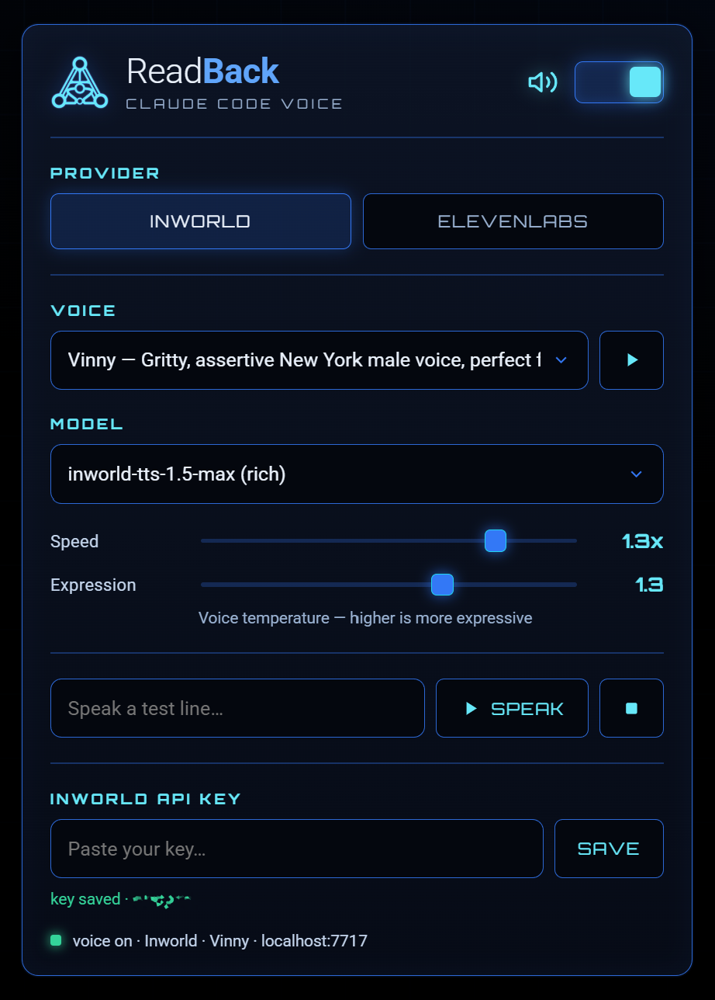

# Readback

**Voice output for Claude Code.** Flip it on and Claude reads its replies aloud,
so you can rest your eyes or keep half an ear on a long run instead of watching
the terminal scroll. Flip it off and it stops immediately, mid-sentence if the
phone rings.

<p align="center">
  
</p>

- 🪟 **Windows-first.** Plays through built-in PowerShell audio, with zero
  external dependencies. (Most Claude voice tools are macOS-only.)
- 🎚️ **Two providers.** [Inworld](https://inworld.ai) (hundreds of voices, cheap)
  and [ElevenLabs](https://elevenlabs.io), switchable in a click.
- 🖥️ **GUI-tunable.** A little control panel for voice, model, speed and
  expression, with a live voice picker and in-app key entry. No `.env` fiddling.
- ⚡ **Streaming.** Splits replies into sentences and starts talking on the first
  one, so audio kicks in fast even on long messages.
- 🔀 **Multi-session.** Running several Claude projects at once? Their replies
  **queue and read in order** instead of cutting each other off. Voice off still
  silences everything instantly.

> Unofficial community tool. Not affiliated with, or endorsed by, Anthropic,
> Inworld, or ElevenLabs.

**Already using it?** See the [changelog](CHANGELOG.md). 0.5.0 fixes the stop
path at its root: stale player bookkeeping, concurrent saves, the process sweep,
and long replies. It ships with regression tests that fail without those fixes.
If you are on any 0.4.x, `git pull` to update.

---

## How it works

Three cooperating pieces sharing one state file:

| Piece | Role |
|------|------|
| **MCP server** | in-chat toggle: `voice_on` / `voice_off` / `set_provider` / `set_voice` / `say` / `list_voices` |
| **Stop hook** | the actual voice: auto-speaks each reply while enabled |
| **Control panel** | `localhost:7717` web cockpit for provider / voice / model / tuning + live preview |

The hook and MCP toggle work whether or not the panel is open.

## Setup (Windows, Node 18+)

```powershell
git clone https://github.com/Deltawerks/readback
cd readback
npm install
npm run panel        # opens the control panel in your browser
```

In the panel: pick a **provider**, paste that provider's **API key**, choose a
**voice**, and hit ▶ to hear it. Then wire it into Claude Code:

```powershell
npm run register     # writes .mcp.json + hooks-snippet.json for this folder
```

**1. MCP server** (the in-chat toggle). Auto-loads whenever you work in this
folder. To get it in *every* project, run the `claude mcp add` line that
`register` prints. That line uses **user scope** (`-s user`), which registers the
server once for your whole account. It matters: `claude mcp add` defaults to
local scope, which is only the project folder you ran it in, so without `-s user`
you get the toggle tools in one folder while the hook goes on speaking in every
other project.

**2. Auto-speak hook** (the part that actually talks). Open your Claude Code
settings at `C:\Users\<you>\.claude\settings.json`. What you do next depends on
what is already in that file.

*No settings file yet:* paste in the whole `hooks-snippet.json` that `register`
just wrote, as the entire file.

*A settings file with no `hooks` key:* add the snippet's `"hooks"` block as one
more top-level key, next to your existing settings.

*A settings file that already has a `hooks` key:* keep that key and put the
snippet's `"Stop"` entry **inside** it, alongside the hooks you already have:

```json
{
  "yourExistingSettings": "stay exactly as they are",
  "hooks": {
    "PreToolUse": [
      { "matcher": "Bash", "hooks": [ { "type": "command", "command": "node", "args": ["C:\\your\\existing\\hook.js"] } ] }
    ],
    "Stop": [
      { "hooks": [ { "type": "command", "command": "node", "args": ["C:\\path\\to\\readback\\hook\\stop-hook.js"], "timeout": 15 } ] }
    ]
  }
}
```

> **Never paste a second `"hooks"` key.** An object with the same key twice is
> still valid JSON, and the parser keeps the last one, so every hook you had
> before is dropped, silently, with no error anywhere.

If you already have a `"Stop"` array of your own, the same rule applies one level
down: add Readback's `{ "hooks": [ ... ] }` entry to that existing array instead
of adding a second `"Stop"` key.

Use the path from *your* generated snippet, not the one above. Then **restart
Claude Code**, say "voice on", and the next reply should speak.

**Optional:** `npm run shortcut` drops a "Readback" icon on your Desktop that
opens the panel in one click.

Quick smoke test, no Claude Code required:

```powershell
npm run say "readback is online"
npm run voices        # list the active provider's voices
```

### Day to day (and after a reboot)

**Nothing to restart.** Claude Code launches the MCP server itself, and the hook
is just a line in its settings file, so both come back on their own after a
reboot.

The control panel is **optional and on-demand**: a settings GUI, not a background
service. Voice keeps working whether or not it's open, because the hook reads
your saved settings from disk. Launch it (Desktop icon or `npm run panel`) when
you want to switch voice, provider or speed, then close it again.

## Using it

- In chat: say "voice on" and replies start speaking. "voice off" silences
  instantly, including whatever's playing right then.
- Multiple projects at once: their replies line up and read one after another
  instead of stomping each other. "voice off" (or the panel's Stop button) clears
  the whole queue at once, for when the phone rings.
- In the panel: switch provider, pick a voice, drag speed / expression, hit ▶ to
  preview. The panel's Speak/preview takes over immediately (it's you, at the
  keyboard); only the automatic per-reply speech queues.
- Voice off means off. The MCP `say` tool now refuses while voice is off, unless
  it is called with `force: true`, so Claude can't decide to talk over a mute you
  just pressed. The panel's Speak and preview buttons are unaffected: that is you
  at the keyboard, asking for it.

Keys are stored per-user **outside the repo**: `%APPDATA%\Readback\secret.json`
on Windows (`~/.config/readback/` elsewhere), so cloning into a shared or
cloud-synced folder can't sync your key with it. Override the location with
`READBACK_STATE_DIR`.

Working files (the log, the queue, the list of running players, the WAV chunks)
live separately in `%LOCALAPPDATA%\Readback` (`~/.cache/readback` elsewhere), so
they can't bloat a synced profile. Override that with `READBACK_CACHE_DIR`.

> **If you override either path, set it for every Readback process, not just
> one.** The panel, the MCP server and each hook worker resolve these
> independently from the environment they were launched in. When they disagree,
> the toggle appears to work and controls nothing, because the half that speaks
> is reading different files than the half you clicked. `npm run where` prints
> the resolved paths; run it from the panel's environment and from a Claude Code
> session and compare. The panel also reports both at `/health`.

Replies are cleaned before speaking (code blocks dropped,
links flattened, markdown/emoji stripped). Extremely long replies are capped
with a spoken "the rest is on screen", but the cap is deliberately high so it
acts as a backstop rather than clipping normal replies. Set
`READBACK_MAX_CHARS` if you want a shorter ceiling on how long a read can run.

> **Upgrading from an earlier version?** Your key and settings are copied to the
> new location automatically on first run. The originals are left in the repo's
> `.readback/` folder (gitignored), so nothing is lost if you roll back. Delete
> that folder once you've confirmed things still work.

## Notes & limits

- Windows only (PowerShell `SoundPlayer` playback). No STT / voice input.
- Speech is provider-agnostic WAV under the hood (Inworld LINEAR16; ElevenLabs
  PCM wrapped in a WAV header), so the streaming player never cares which
  provider you're on.
- The panel is loopback-only (`127.0.0.1`), rejects cross-origin requests, and
  bundles its own logo + fonts, so the page itself loads nothing from the
  internet.
- Synthesis *does* call out, by design: your cleaned, truncated reply text and
  your API key go to whichever provider you picked (Inworld or ElevenLabs) over
  HTTPS, and nowhere else. Readback has no servers, no telemetry, no analytics,
  and no update check.
- **It costs money per character spoken.** Readback defaults to the cheapest
  sensible model, Inworld `tts-1.5-mini`, at $0.005 per 1,000 characters ($5 per
  million); `max` is double that for a bit more richness. **ElevenLabs costs 10
  to 20 times as much**: $0.05 per 1,000 characters on Flash and Turbo, $0.10 on
  `eleven_v3` and `eleven_multilingual_v2`. At the default 12,000 character cap,
  one long reply is about 6 cents on Inworld mini and $0.60 to $1.20 on
  ElevenLabs. If you run ElevenLabs, set `READBACK_MAX_CHARS` to something
  shorter so a wall of text can't run up a dollar on its own. The panel shows the
  rate for the model you have selected. Worth knowing either way: if you add the
  hook to your global `settings.json`, it speaks in *every* project where voice
  is on, which adds up faster than you'd guess. Keep it per-project, or toggle
  voice off when you're not listening.
- Trouble? Check `readback.log` in `%LOCALAPPDATA%\Readback` on Windows
  (throwaway data is kept out of the roaming profile), or alongside the state dir
  otherwise.

## License

MIT. See [LICENSE](LICENSE).
